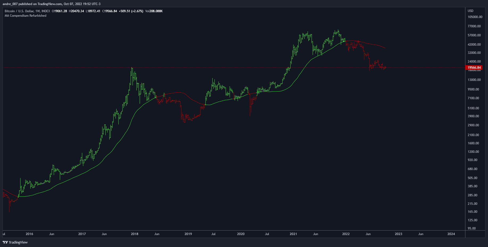

# Moving Averages Proxy

This is a library of all moving averages spread out in different libraries.

It's developed in PineScript for the technical analysis platform of **TradingView**.

## Thanks and Credits

- TradingView
- PineCoders
- CrackingCryptocurrency
- MightyZinger
- Alex Orekhov (everget)
- alexgrover
- paragjyoti2012
- Franklin Moormann (cheatcountry)

## Donations

- BTC: 1PnerhP2C5xeGXxAkhxQX4rYrBUguGe1yh
- LTC: LMhAfkzJoUHHWfFCcMnnQ4jdV4Vi9WZG3W
- Stellar: GCPONJ5OX7KSEHBNPB2SKJZJGYSXTRN7ORYQXW443BLEFLS72ZVYISG2
- Zcash: t1THe8JvsYqt7bmbFWkFpjssJhJLka6VAhk
- Tron: TSVnEgtoYhRMwiRYfDFC51XfGNSpxse2yz
